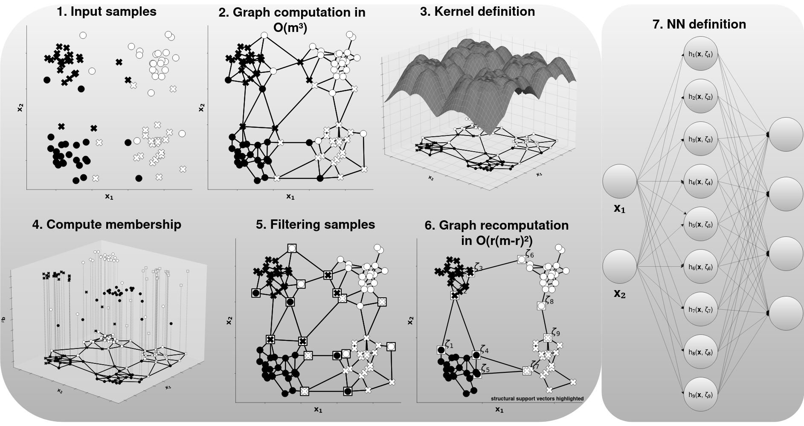

# Multiclass Graph-Based Large Margin Classifiers: Unified Approach for Support Vectors and Neural Networks

[](LICENSE)

Repository containing the implementation of *"Multiclass Graph-Based Large Margin Classifiers: Unified Approach for Support Vectors and Neural Networks"*, in *IEEE Transactions on Neural Networks and Learning Systems* (2024).

DOI: https://doi.org/10.1109/TNNLS.2024.3420227 \
arXiv: https://arxiv.org/abs/2512.13410

<p align="center">

</p>

If you find this work useful, please cite:

```
@article{hanriot2024multiclass,
  title={Multiclass graph-based large margin classifiers: Unified approach for support vectors and neural networks},
  author={Hanriot, V{\'\i}tor M and Torres, Luiz CB and Braga, Ant{\^o}nio P},
  journal={IEEE Transactions on Neural Networks and Learning Systems},
  volume={36},
  number={5},
  pages={8307--8316},
  year={2024},
  publisher={IEEE}
}
```

## 1. Dependencies

### Case I - Running Python locally

```bash
python -m venv .venv
source .venv/bin/activate
pip install -r requirements.txt
pip install -e .
```

### Case II - Using Docker
`docker build -t multiclass-graph-based-classifiers-tnnls-2024 .`

If you use Docker, replace each `python <script>` command below with \
`docker run --rm -v "$(pwd)/results:/results" -v "$(pwd)/figures:/main/figures" multiclass-graph-based-classifiers-tnnls-2024 python <script>`

## 2. Example usage

The Gabriel graph implementation is available [here](src/main/models/graph_models/graph/GG.py), and the SSV-oriented Chipclass is available [here](src/main/models/graph_models/GGRBF.py).

To train and evaluate the multiclass SSV-oriented Chipclass:
```
from sklearn import datasets
from sklearn.model_selection import train_test_split
from main.models.graph_models.GGRBF import GGRBF
dataset = datasets.load_iris()
X = dataset["data"]
y = dataset["target"]
y = y.astype(float)
X_train, X_test, y_train, y_test = train_test_split(X, y, test_size=0.5, random_state=42)
clf = GGRBF()
clf.fit(X_train, y_train)
yhat = clf.predict(X_test)
```

To use flexible thresholds (from https://doi.org/10.1016/j.patrec.2025.09.008), instantiate the class with *flex_reg=True* and class-specific parameters (e.g. for a problem with 3 classes):

```
clf = GGRBF(flex_reg=True, perc1=20, perc2=30, perc3=40)
```

## 3. Reproduce results

After installing the dependencies, run the following scripts from the repository root to reproduce the main experimental results reported in the paper:

### Table II - Ablation study

```bash
python scripts/tables/ablation_study.py
```

Outputs are written to [ablation study results](results/ablation_study/).

### Table III - GG-based models comparison

```bash
python scripts/tables/gg_comp.py
```

Outputs are written to [gg comparisons](results/gg_comp/).

### Table IV - GG-based models and baselines

```bash
python scripts/tables/gg_baselines.py
```

Outputs are written to [binary results](results/gg_baselines/).

### Table V - GG-based models and baselines on multiclass datasets

```bash
python scripts/tables/multiclass.py
```

Outputs are written to [multiclass results](results/multiclass/).

### Regenerate statistical values obtained from the tables

Results from the paper are stored in [results backup](results_bkp).

Tables II-V can be checked with:
```
python scripts/tables/gen_latex_table.py -f results_bkp -e ablation_study
python scripts/tables/gen_latex_table.py -f results_bkp -e gg_comp
python scripts/tables/gen_latex_table.py -f results_bkp -e gg_baselines
python scripts/tables/gen_latex_table.py -f results_bkp -e multiclass
```

## 4. Generate figures from the paper

- Figure 2: `python scripts/gen_figs/is_gg.py`
- Figure 3: `python scripts/gen_figs/gg_formulation.py`
- Figure 4: `python scripts/gen_figs/plot_ssvs_ses.py`
- Figure 6: `python scripts/gen_figs/act_fun_analysis.py`
- Figure 7: `python scripts/gen_figs/analysis_filter.py`
- Figure 8: `python scripts/gen_figs/sigma_changes3d.py`
- Figure 9: `python scripts/gen_figs/sigma_tuned.py`
- Figure 10: `python scripts/gen_figs/venn.py`
- Figure 14: `python scripts/gen_figs/graphical_abstract.py`
- Figure 15: `python scripts/gen_figs/study_recgg_time.py`
- Figure 16: `python scripts/gen_figs/study_quality.py`

## 5. License

This repository is distributed under the terms of the [GPLv3](LICENSE).

This work was carried out at the Computational Intelligence Laboratory (LITC), Universidade Federal de Minas Gerais (UFMG).

<p align="center">
  
  
</p>
